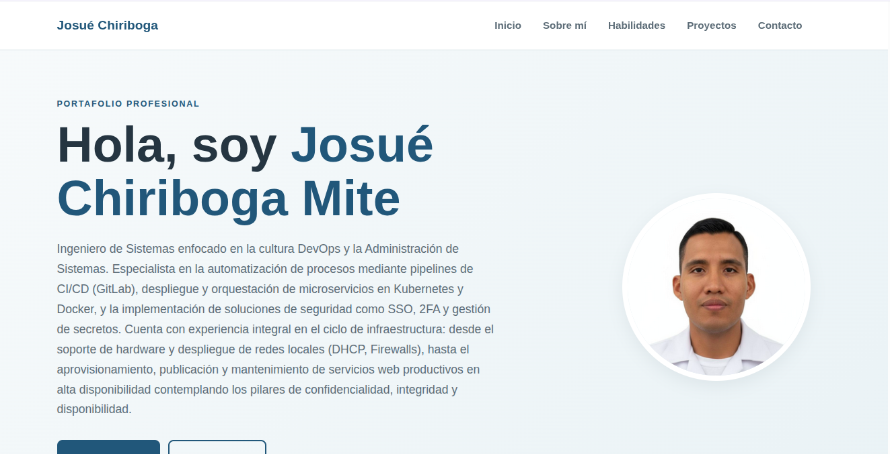

# Portafolio Profesional — Josué Chiriboga

**Nombre del proyecto:** Portafolio Profesional (Programacion_web)

**Nombre del estudiante:** Josué Chiriboga Mite

## Descripción

Portafolio personal estático de una sola página que presenta el perfil profesional de Josué Chiriboga, ingeniero de sistemas con enfoque en cultura DevOps, administración de sistemas, CI/CD, Kubernetes y Docker.

El sitio incluye las secciones:

- **Inicio**: presentación y foto de perfil.
- **Sobre mí**: reseña personal, estudios realizados y línea de tiempo.
- **Habilidades y cursos**: tecnologías que maneja y certificaciones.
- **Proyectos**: proyectos personales, académicos y colaboraciones.
- **Contacto**: datos de contacto y un formulario de demostración (Nombre, Correo electrónico, Mensaje y botón Enviar). El formulario no envía información realmente; solo muestra un mensaje de confirmación.

## Tecnologías utilizadas

- HTML5
- CSS3 (diseño responsivo, variables CSS, grid y flexbox)
- JavaScript (validación y confirmación del formulario de contacto)
- Nginx (servidor web para publicar el sitio en local)

## Instrucciones para visualizar el proyecto

El proyecto es 100 % estático, no requiere instalación ni compilación.

**Opción 1 — Con Docker + Nginx (recomendada):**

En el directorio padre del proyecto (`.../Portafolio`) está el archivo `docker -compose.yml`, que levanta Nginx y publica el sitio en el puerto **8080**:

```bash
cd /home/joyschim/Documents/gitproyect/Portafolio
docker compose -f "docker -compose.yml" up -d
```

Luego abre `http://localhost:8080` en el navegador.

Para detenerlo: `docker compose -f "docker -compose.yml" down`.

Nota: el contenedor monta la carpeta `Programacion_web` en `/usr/share/nginx/html` (solo lectura), por lo que los cambios en los archivos se reflejan al recargar la página, sin necesidad de reiniciar el contenedor.

**Opción 2 — Abriendo el archivo directamente:**

- Haz doble clic sobre `index.html` o arrástralo al navegador.

**Opción 3 — Con Python (servidor temporal):**

```bash
python3 -m http.server 8000
```

Luego abre `http://localhost:8000` en el navegador.

## Captura de pantalla


